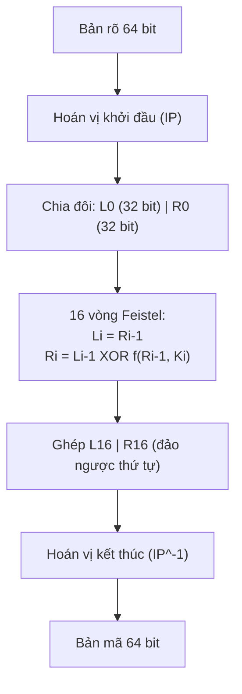
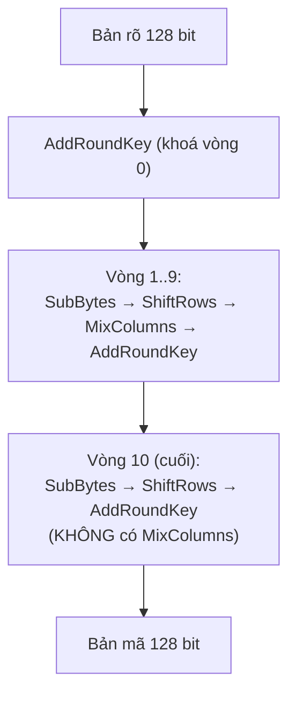
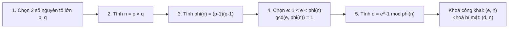
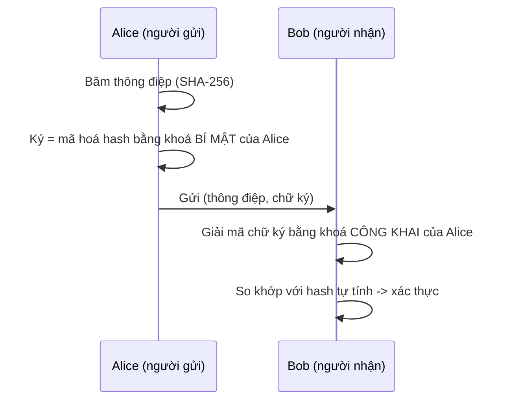
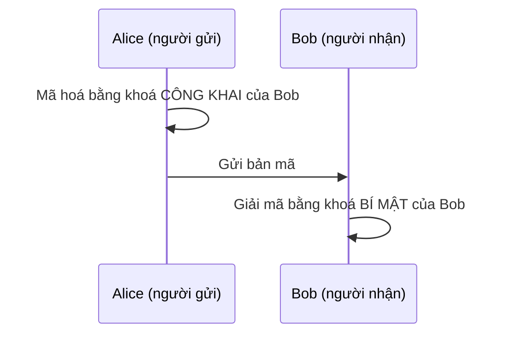
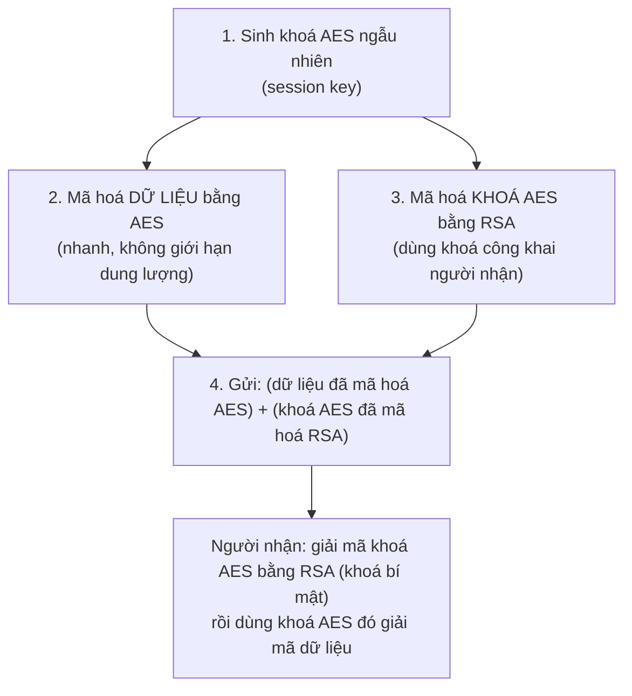

# Môn An toàn và bảo mật thông tin

> Nội dung: tìm hiểu DES/AES, cài đặt AES, tìm hiểu RSA, các mô hình áp dụng RSA,
> so sánh tốc độ RSA/AES, kết hợp RSA + AES.

## Mục lục
1. [Thuật toán DES](#1-thuật-toán-des)
2. [Thuật toán AES](#2-thuật-toán-aes)
3. [Cài đặt AES](#3-cài-đặt-aes-filesaespy)
4. [Thuật toán RSA](#4-thuật-toán-rsa)
5. [Các mô hình áp dụng RSA](#5-các-mô-hình-áp-dụng-rsa)
6. [So sánh tốc độ RSA và AES](#6-so-sánh-tốc-độ-rsa-và-aes)
7. [Kết hợp RSA và AES (mã hoá lai)](#7-kết-hợp-rsa-và-aes-mã-hoá-lai---hybrid-encryption)

---

## 1. Thuật toán DES

**DES (Data Encryption Standard)** là thuật toán mã hoá **đối xứng** (cùng một khoá dùng để
mã hoá và giải mã), chuẩn hoá bởi NIST năm 1977.

- **Kích thước khối**: 64 bit.
- **Kích thước khoá**: 56 bit thực dùng (lưu trữ dạng 64 bit, có 8 bit kiểm tra chẵn lẻ).
- **Cấu trúc**: mạng Feistel, gồm **16 vòng lặp** giống hệt nhau.

### Quy trình mã hoá DES



Hàm `f` trong mỗi vòng gồm 4 bước: **Mở rộng (E)** 32→48 bit → **XOR** với khoá con Ki (48 bit)
→ **thay thế qua 8 hộp S-box** (48→32 bit) → **hoán vị P**.

**Sinh khoá con**: khoá 64 bit → hoán vị PC-1 loại bỏ 8 bit kiểm tra (còn 56 bit) → chia
C0/D0 (28 bit mỗi bên) → mỗi vòng dịch trái 1-2 bit → hoán vị nén PC-2 (56→48 bit) tạo khoá
con Ki cho vòng đó.

**Giải mã**: thực hiện lại đúng quy trình trên nhưng dùng thứ tự khoá con **ngược lại**
(K16 → K1), do cấu trúc Feistel đối xứng hai chiều.

**Hạn chế**: khoá 56 bit hiện nay có thể bị brute-force trong thời gian ngắn với phần cứng
hiện đại (DES đã bị phá năm 1998 bởi máy "DES Cracker"). Vì vậy DES ngày nay được xem là
**không an toàn**, chỉ còn giá trị giáo dục hoặc dùng dạng 3DES (áp dụng DES 3 lần) cho các
hệ thống cũ.

---

## 2. Thuật toán AES

**AES (Advanced Encryption Standard)** là thuật toán mã hoá đối xứng thay thế DES, chuẩn hoá
bởi NIST năm 2001 (FIPS-197), dựa trên thuật toán Rijndael.

- **Kích thước khối**: 128 bit (cố định).
- **Kích thước khoá**: 128 / 192 / 256 bit → tương ứng **10 / 12 / 14 vòng lặp**.
- **Cấu trúc**: mạng thay thế - hoán vị (Substitution-Permutation Network), **không** phải
  Feistel như DES → mỗi vòng biến đổi toàn bộ khối chứ không chỉ một nửa.
- Dữ liệu được biểu diễn dưới dạng ma trận **State** 4×4 byte (16 byte = 128 bit).

### Quy trình mã hoá AES-128 (10 vòng)



4 phép biến đổi trong mỗi vòng:

| Bước | Vai trò |
|---|---|
| **SubBytes** | Thay từng byte của State theo bảng tra **S-box** (phi tuyến, chống phân tích tuyến tính) |
| **ShiftRows** | Dịch trái vòng từng hàng của State (hàng r dịch r vị trí) → khuếch tán theo hàng |
| **MixColumns** | Nhân từng cột State với ma trận cố định trong trường hữu hạn GF(2⁸) → khuếch tán theo cột |
| **AddRoundKey** | XOR State với khoá con của vòng đó |

**Sinh khoá mở rộng (Key Expansion)**: từ khoá gốc 16 byte, sinh ra 44 từ (word, 4 byte/từ)
đủ cho 11 khoá vòng (vòng 0 → vòng 10). Mỗi 4 từ, từ đầu tiên được biến đổi qua
**RotWord** (xoay trái 1 byte) → **SubWord** (tra S-box) → XOR với hằng số vòng **Rcon**.

**Giải mã**: áp dụng các phép biến đổi **nghịch đảo** theo thứ tự ngược lại
(`InvShiftRows`, `InvSubBytes`, `InvMixColumns`), dùng lại đúng các khoá vòng nhưng theo
chiều từ vòng 10 về vòng 0.

**Vì sao AES an toàn hơn DES**: không gian khoá lớn hơn nhiều (128 bit ≈ 3.4×10³⁸ khả năng,
so với 56 bit ≈ 7.2×10¹⁶ của DES), cấu trúc SPN khuếch tán nhanh hơn Feistel, và cho đến nay
chưa có tấn công nào hiệu quả hơn brute-force trên AES với đủ số vòng.

---

## 3. Cài đặt AES (file [`aes.py`](aes.py))

Đã cài đặt **AES-128 từ đầu** (không dùng thư viện mã hoá có sẵn), gồm đầy đủ:
`S-box`/`Inverse S-box`, `SubBytes`/`InvSubBytes`, `ShiftRows`/`InvShiftRows`,
`MixColumns`/`InvMixColumns` (nhân trong GF(2⁸)), `AddRoundKey`, `Key Expansion`,
và chế độ **CBC + đệm PKCS#7** để mã hoá được văn bản có độ dài bất kỳ.

**Đã kiểm tra đúng** với bộ test vector chuẩn **FIPS-197** của NIST:

```
Khoá        : 000102030405060708090a0b0c0d0e0f
Bản rõ      : 00112233445566778899aabbccddeeff
Bản mã tính : 69c4e0d86a7b0430d8cdb78070b4c55a
Bản mã chuẩn: 69c4e0d86a7b0430d8cdb78070b4c55a
=> KẾT QUẢ MÃ HOÁ: ĐÚNG
=> KẾT QUẢ GIẢI MÃ: ĐÚNG
```

Chạy thử:
```bash
python3 aes.py
```


---

## 4. Thuật toán RSA

**RSA** (Rivest–Shamir–Adleman, 1977) là thuật toán mã hoá **bất đối xứng** đầu tiên được
sử dụng rộng rãi: dùng **2 khoá khác nhau** — khoá **công khai** để mã hoá, khoá **bí mật**
để giải mã (hoặc ngược lại khi ký số).

### Nguyên lý sinh cặp khoá



1. Chọn ngẫu nhiên 2 số nguyên tố lớn `p`, `q` (thường ≥ 512 bit mỗi số với khoá 1024 bit).
2. Tính modulus `n = p × q` — dùng chung cho cả khoá công khai lẫn bí mật.
3. Tính hàm Euler `φ(n) = (p−1)(q−1)`.
4. Chọn số mũ công khai `e` sao cho `1 < e < φ(n)` và `gcd(e, φ(n)) = 1` (thường chọn
   `e = 65537` vì vừa đủ lớn để an toàn, vừa ít bit-1 giúp mã hoá nhanh).
5. Tính số mũ bí mật `d` là **nghịch đảo modulo** của `e`: `d × e ≡ 1 (mod φ(n))`
   (dùng thuật toán Euclid mở rộng).

- **Mã hoá**: `c = m^e mod n`
- **Giải mã**: `m = c^d mod n`
- **Độ an toàn**: dựa trên độ khó của bài toán **phân tích thừa số nguyên tố** của `n`
  (biết `n` nhưng không biết `p, q` thì không tính được `φ(n)`, do đó không tính được `d`).
  Với `n` đủ lớn (≥ 2048 bit trong thực tế), bài toán này chưa có thuật toán giải hiệu quả
  trên máy tính cổ điển.

Cài đặt đầy đủ (sinh số nguyên tố bằng Miller-Rabin, Euclid mở rộng, mã hoá/giải mã,
ký số/xác thực) tại [`rsa.py`](rsa.py). Chạy thử: `python3 rsa.py`

---

## 5. Các mô hình áp dụng RSA

RSA dùng cặp khoá (công khai / bí mật) theo 2 chiều khác nhau tuỳ mục đích:

### Mô hình 1 — Xác thực người gửi (chữ ký số)
Người gửi **ký** bằng khoá **BÍ MẬT của chính mình**; người nhận **xác thực** bằng khoá
**CÔNG KHAI của người gửi**.


→ Đảm bảo **đúng người gửi** + **chống chối bỏ**, nhưng **không** bảo mật nội dung vì ai
cũng có khoá công khai của Alice để đọc lại.

### Mô hình 2 — Xác thực người nhận (mã hoá bảo mật)
Người gửi **mã hoá** bằng khoá **CÔNG KHAI của người nhận**; chỉ người nhận **giải mã**
được bằng khoá **BÍ MẬT của chính họ**.


→ Đảm bảo **chỉ Bob đọc được** (bảo mật nội dung), nhưng **không** xác thực được ai thực
sự là người gửi (ai cũng có khoá công khai của Bob để mã hoá).

### Mô hình 3 — Kết hợp cả hai
Kết hợp ký (khoá bí mật của người gửi) **và** mã hoá (khoá công khai của người nhận) →
vừa bảo mật nội dung, vừa xác thực người gửi. Cả 3 mô hình đã được cài đặt và chạy thử
thành công trong [`rsa.py`](rsa.py) (phần `if __name__ == "__main__"`).


---

## 6. So sánh tốc độ RSA và AES

Số liệu đo thực tế (không phải số liệu tra cứu) từ [`benchmark_rsa_aes.py`](benchmark_rsa_aes.py),
chạy trên máy chạy chương trình này:

| Kích thước dữ liệu | AES mã hoá | AES giải mã |
|---|---|---|
| 16 byte | 0.87 ms | 1.18 ms |
| 64 byte | 1.65 ms | 2.88 ms |
| 256 byte | 5.79 ms | 9.99 ms |
| 1024 byte | 21.99 ms | 38.78 ms |
| 4096 byte | 91.24 ms | 157.80 ms |

| RSA-1024 (64 byte, tối đa ~117 byte/lần) | Thời gian |
|---|---|
| Mã hoá | 0.16 ms |
| Giải mã | 4.37 ms |

**Nhận xét quan trọng — vì sao số liệu trên khác với lý thuyết sách giáo khoa:**

Lý thuyết chuẩn (và thực tế khi dùng thư viện mã hoá tối ưu/phần cứng) là **AES nhanh hơn
RSA rất nhiều lần** (thường 100–1000 lần), vì AES chỉ dùng các phép XOR/thay thế/hoán vị
đơn giản trên từng byte, còn RSA phải tính **luỹ thừa modulo với số nguyên hàng nghìn bit**
— một phép toán nặng hơn nhiều.

Tuy nhiên bảng số liệu trên đo AES **tự cài đặt bằng Python thuần** (đúng yêu cầu đề bài,
để thể hiện quy trình thuật toán), trong khi hàm `pow()` của RSA lại được Python cài đặt tối
ưu ở tầng C. Để kiểm chứng, nhóm đã đo thêm bằng thư viện `PyCryptodome` (AES dùng tập lệnh
phần cứng AES-NI):

```
AES tự cài đặt (pure Python)      : 22.67 ms / 1024 byte
AES thư viện tối ưu (PyCryptodome): 0.48 ms / 1024 byte   (nhanh hơn ~47 lần)
```

**Kết luận đúng bản chất thuật toán**: nếu dùng cài đặt tối ưu (hoặc phần cứng hỗ trợ),
AES nhanh hơn RSA rất nhiều lần và có thể xử lý dữ liệu dung lượng lớn trực tiếp; RSA vừa
chậm vừa bị giới hạn kích thước bản rõ theo độ dài khoá (RSA-1024 chỉ mã hoá tối đa ~117
byte/lần) nên **không phù hợp để mã hoá trực tiếp dữ liệu lớn**. Đây chính là lý do tồn tại
mô hình mã hoá lai (hybrid) ở phần tiếp theo.


---

## 7. Kết hợp RSA và AES (mã hoá lai - hybrid encryption)

Vì RSA chậm và giới hạn kích thước, còn AES nhanh nhưng cần trao đổi khoá bí mật an toàn
trước, thực tế (TLS/HTTPS, PGP, v.v.) người ta **kết hợp cả hai**:



- **RSA** chỉ dùng để mã hoá một khối dữ liệu rất nhỏ: khoá phiên AES (16/32 byte) →
  tận dụng thế mạnh trao đổi khoá an toàn giữa 2 bên chưa từng gặp nhau, không lo bị chậm
  vì dữ liệu mã hoá bằng RSA rất nhỏ.
- **AES** dùng để mã hoá toàn bộ dữ liệu thật (có thể hàng MB/GB) → tận dụng tốc độ cao,
  không giới hạn dung lượng.
- Đây chính xác là cách hoạt động của **HTTPS/TLS**: bắt tay (handshake) dùng RSA (hoặc
  Diffie-Hellman) để thoả thuận khoá phiên, sau đó toàn bộ traffic dùng AES.

**Ưu điểm của kết hợp**: vừa có tốc độ cao của mã đối xứng, vừa có khả năng trao đổi khoá
an toàn qua kênh không tin cậy của mã bất đối xứng, mà không phải đánh đổi giữa 2 nhược
điểm (RSA chậm + AES cần kênh trao đổi khoá an toàn từ trước).
